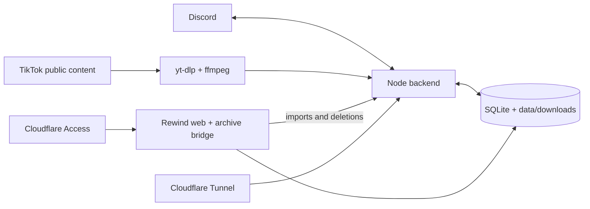

# tiktok-dlp

Self-hosted TikTok downloader and archive with Discord monitoring, full-profile
imports, and **Rewind**: a private, mobile-first feed and dashboard for watching
and managing saved videos.

The backend uses `yt-dlp`, ffmpeg, Node.js, SQLite, and filesystem storage. The
Rewind web app adds a touch-first video feed, creator galleries, archive search,
imports, downloads, and confirmed deletion controls. Docker Compose runs both
surfaces, while Cloudflare Tunnel can expose tokenized downloads and a
Cloudflare Access-protected archive.

> [!IMPORTANT]
> This project works with public TikTok content. It does not bypass private
> accounts, deleted content, paywalls, or TikTok access controls. Make sure your
> use complies with the platform's terms and applicable law.

## Features

### Discord downloader and monitor

- Downloads public TikTok videos from slash commands, DMs, and up to three URLs
  in a Discord message.
- Handles public photo/slideshow posts with a direct fallback and ZIP output.
- Performs best-effort public story discovery and downloads.
- Monitors creators on a per-server or per-DM subscription basis.
- Detects creator username changes and reports when saved source posts disappear.
- Uses a bounded, deduplicated download queue with per-user and per-server limits.
- Reuses immutable saved assets instead of downloading the same post repeatedly.
- Delivers small files through Discord and larger files through tokenized links.
- Supports temporary links, extensions, permanent retention, history, and purge.

### Creator imports and archive management

- Imports an entire public creator profile through the dashboard or admin API.
- Skips already saved posts and videos above an adjustable duration limit.
- Tracks queued, running, completed, and failed import work.
- Stores archive state in SQLite and media under `data/downloads`.
- Deletes individual saved videos or every saved video for one creator, with
  explicit confirmation.

### Rewind web app

- Full-height, scroll-snap video feed optimized for mobile playback.
- Fresh shuffled ordering per visit, plus an explicit Shuffle action.
- All and browser-local Bookmarks feeds with creator filtering.
- Original captions and hashtags, a post-date fallback for captionless videos,
  creator links, and source links.
- Adjacent media and thumbnail preloading, buffering/error feedback, remembered
  sound, autoplay control, and exact-video deep links.
- Creator profile pages with thumbnail grids that jump directly into the feed.
- Searchable video library with thumbnails, creator filters, downloads, source
  links, and confirmed deletion.
- Creator dashboard with import progress, monitoring status, profile/library
  shortcuts, and typed-confirmation bulk deletion.
- Responsive, keyboard-aware navigation, menus, dialogs, and recovery states.

Rewind currently indexes archived MP4 records. Photo/slideshow ZIPs delivered by
the Discord bot are not shown in its video feed.

## Architecture



The backend owns Discord, monitoring, imports, retention, and destructive
archive mutations. Rewind mounts the archive data read-only, derives creators,
videos, thumbnails, and statistics, and forwards authorized import/delete
requests to the backend over the private Docker network.

## Requirements

Recommended production setup:

- Docker Engine with Docker Compose
- A Discord application and bot token
- A public hostname for tokenized Discord downloads
- A private hostname for Rewind, protected by Cloudflare Access or an equivalent
  authentication layer

For direct local development:

- Node.js `>=22.13.0`
- `yt-dlp` and ffmpeg for backend download work
- SQLite CLI, Python 3, and ffmpeg for the live Rewind bridge

## Quick start with Docker

1. Clone the repository and prepare the environment:

   ```bash
   git clone https://github.com/nqrwhal/tiktok-dlp.git
   cd tiktok-dlp
   cp .env.example .env
   ```

2. Set the required values in `.env`:

   ```env
   DISCORD_TOKEN=...
   DISCORD_CLIENT_ID=...
   PUBLIC_BASE_URL=https://downloads.example.com
   REWIND_PUBLIC_URL=https://rewind.example.com
   IMPORT_API_TOKEN=use-a-long-random-secret
   ```

   `IMPORT_API_TOKEN` protects the backend admin hop used by the Rewind service.
   Generate a secret with a password manager or a command such as
   `openssl rand -hex 32`.

3. Register the global Discord commands:

   ```bash
   npm install
   npm run register:commands
   ```

   Alternatively, set `REGISTER_COMMANDS_ON_START=true` for the first backend
   start, then turn it off after registration succeeds.

4. Start the backend and Rewind services:

   ```bash
   docker compose up --build -d
   docker compose logs -f
   ```

Compose uses `expose`, not host-published `ports`; the services remain available
only inside the Docker network. Use the Cloudflare profile, another reverse
proxy, or an explicit local Compose override to reach them from outside it.

Persistent state and downloads live under `./data`. Optional TikTok cookies can
be mounted from `./cookies`.

## Cloudflare Tunnel and private access

Configure two public hostnames on the same tunnel:

```text
downloads.example.com -> http://tiktok-discord-downloader:8080
rewind.example.com    -> http://rewind-web:3000
```

- Set `PUBLIC_BASE_URL` to the download hostname.
- Set `REWIND_PUBLIC_URL` to the Rewind hostname.
- Protect the entire Rewind hostname with Cloudflare Access. Rewind includes
  live import and destructive deletion routes and does not provide its own
  application login.

Add the tunnel token to `.env`, prepare the Docker secret, and start the profile:

```env
CLOUDFLARE_TUNNEL_TOKEN=...
```

```bash
npm run prepare:tunnel
docker compose --profile cloudflare up --build -d
```

The preparation script writes `.secrets/cloudflare_tunnel_token` with restricted
permissions. Only the `cloudflared` container receives that secret.

Health endpoints:

```bash
curl https://downloads.example.com/health
curl https://rewind.example.com/api/health
```

The second request must satisfy the private access policy.

## Discord commands

- `/download url:<tiktok-url> delivery:auto|file|link`
- `/watch add username:<username>`
- `/watch remove username:<username>`
- `/watch list`
- `/watch run username:<username>`
- `/status`
- `/history`
- `/downloads list limit:<1-25> username:<username>`
- `/downloads purge scope:mine|all confirm:PURGE`

The bot also reacts to TikTok URLs in readable guild channels and DMs. For
message-based help, use `tiktok help`, `!tiktok help`, mention the bot with
`help`, or DM it `help`.

The bot requires the `Guilds`, `Guild Messages`, `Direct Messages`, and
`Message Content` intents. Enable Message Content in the Discord developer
portal.

Watch management requires Manage Server, `WATCH_MANAGER_ROLE_ID`, or
`DISCORD_OWNER_ID` in DMs. Watches are subscribed per guild/DM, so multiple
destinations can follow one creator without duplicating the underlying scan.

## Rewind routes

| Route | Purpose |
| --- | --- |
| `/` | Shuffled mobile video feed and bookmarks |
| `/creator?creator=<id>` | Creator profile and saved-video grid |
| `/dashboard` | Archive totals, storage, recent files, and monitor health |
| `/dashboard/videos` | Search, filter, play, download, and delete videos |
| `/dashboard/creators` | Search creators, import profiles, and delete creator archives |
| `/dashboard/settings` | Browser-local playback and default-feed preferences |

Bookmarks and playback preferences are stored in the current browser. Archive
files, imports, and deletions are server-backed.

## Creator imports

Start an import through the Rewind creator dashboard or the backend API:

```http
POST /api/imports
Authorization: Bearer <IMPORT_API_TOKEN>
Content-Type: application/json
```

```json
{
  "username": "creator",
  "maxDurationSeconds": 120
}
```

The backend enumerates the complete public profile, skips existing files, skips
videos above the selected limit, and downloads the remaining posts as permanent
archive files. The supported per-import duration range is 1–3600 seconds.

Read progress with `GET /api/imports?limit=20` or `GET /api/imports/:id`.

## HTTP surfaces

Backend:

- `GET|HEAD /health`
- `GET|HEAD /files/:token`
- `GET /api/imports?limit=`
- `POST /api/imports`
- `GET /api/imports/:id`
- `DELETE /api/videos/:fileId`
- `DELETE /api/creators/:username/videos`

Admin routes require a loopback caller or
`Authorization: Bearer <IMPORT_API_TOKEN>`.

Rewind bridge:

- `GET /api/health`
- `GET /api/creators`
- `GET /api/videos?creatorId=&username=&fileId=&limit=`
- `GET /api/stats`
- Import and delete routes proxied to the backend
- `GET|HEAD /media/:fileId`
- `GET|HEAD /media/:fileId?download=1`
- `GET|HEAD /thumbnail/:fileId.jpg`

## Configuration

`.env.example` documents every supported value. The main groups are:

| Area | Variables |
| --- | --- |
| Discord | `DISCORD_TOKEN`, `DISCORD_CLIENT_ID`, `DISCORD_OWNER_ID`, `WATCH_MANAGER_ROLE_ID`, `REGISTER_COMMANDS_ON_START` |
| Public URLs | `PUBLIC_BASE_URL`, `REWIND_PUBLIC_URL`, `CLOUDFLARE_TUNNEL_TOKEN` |
| Monitoring | `POLL_INTERVAL_SECONDS`, `PROFILE_SCAN_LIMIT`, `PROFILE_BURST_SCAN_LIMIT`, `MONITOR_CONCURRENCY` |
| Queue limits | `MAX_CONCURRENT_DOWNLOADS`, `MAX_DOWNLOAD_QUEUE_SIZE`, `MAX_QUEUED_DOWNLOADS_PER_USER`, `MAX_QUEUED_DOWNLOADS_PER_GUILD` |
| Imports | `IMPORT_API_TOKEN`, `IMPORT_MAX_DURATION_SECONDS`, `IMPORT_CONCURRENCY`, `IMPORT_PROFILE_TIMEOUT_SECONDS` |
| Retention | `DOWNLOAD_LINK_TTL_MINUTES`, `RETENTION_DAYS`, `CLEANUP_BATCH_SIZE` |
| Media bounds | `DISCORD_UPLOAD_LIMIT_MB`, `MAX_MEDIA_DOWNLOAD_MB`, `MAX_SLIDESHOW_IMAGES`, `MAX_SLIDESHOW_ITEM_MB`, `MAX_SLIDESHOW_TOTAL_MB` |
| Paths/tools | `DATA_DIR`, `STATE_DB`, `DOWNLOAD_DIR`, `YTDLP_PATH`, `YTDLP_COOKIES_FILE`, `YTDLP_RETRIES`, `YTDLP_TIMEOUT_SECONDS` |

If TikTok requires authenticated cookies for public content in your environment,
place a cookies file at `./cookies/tiktok.txt` and set:

```env
YTDLP_COOKIES_FILE=/app/cookies/tiktok.txt
```

## Retention and storage behavior

- Manual/message downloads receive a temporary server copy by default.
- Buttons can create, extend, or permanently retain requester-owned links.
- Watched deliveries and creator imports are retained permanently by default.
- Shared assets remain until no active delivery references them.
- Cleanup deletes disk bytes before database records and preserves retry state
  when filesystem deletion fails.
- Inactive job/history metadata follows `RETENTION_DAYS`; file retention follows
  active links.
- Source-deletion checks run separately from profile polling so slow probes do
  not block creator monitoring.

## Local development and tests

Backend:

```bash
npm install
npm run dev
npm test
```

Direct backend operation expects `yt-dlp` and ffmpeg on `PATH` unless their
locations are overridden in `.env`.

Frontend with mock archive data:

```bash
cd web
npm install
npm run dev
npm run lint
npm test
```

Frontend against a remote live archive over SSH:

```bash
cd web
npm run dev:live
```

The live bridge defaults to the SSH host `yufeihl` and remote project
`/home/yufei/tiktok-discord-downloader`. Export `LIVE_SSH_HOST`,
`LIVE_REMOTE_PROJECT`, or `LIVE_BRIDGE_PORT` before the command to override
them. It copies requested media on demand, generates and caches thumbnails, and
supports imports and confirmed deletions by forwarding them to the backend.

## Operational notes

- The monitor's normal profile window defaults to 5 posts and expands to a
  20-post burst scan when every normal result is new.
- Profile/story scans and downloads use separate bounded workers.
- Watched creator identity data caches TikTok `secUid` and author IDs when
  available.
- Saved-post deletion checks run frequently at first, then around 30 minutes,
  one hour, one day, and weekly.
- `DOWNLOAD_LINK_TTL_MINUTES` controls new temporary links. Legacy
  `DOWNLOAD_LINK_TTL_HOURS` values are ignored.
