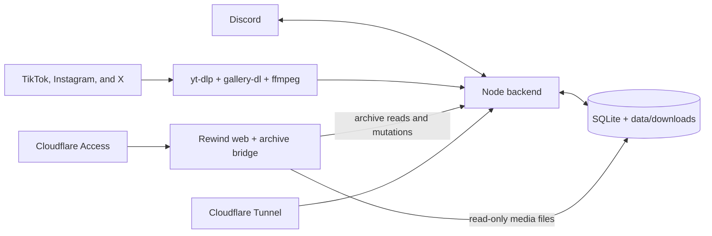

# tiktok-dlp

Self-hosted social-media downloader and archive for TikTok, Instagram, and X,
with TikTok monitoring and full-profile imports plus **Rewind**: a private,
mobile-first feed and dashboard for watching and managing saved videos.

The backend uses `yt-dlp`, `gallery-dl`, ffmpeg, Node.js, SQLite, and filesystem storage. The
Rewind web app adds a touch-first video feed, creator galleries, archive search,
imports, downloads, trash/restore controls, and an installable mobile shell.
Docker Compose runs both
surfaces, while Cloudflare Tunnel can expose tokenized downloads and a
Cloudflare Access-protected archive.

Implementation progress and remaining work are tracked in [WORKLOG.md](WORKLOG.md).

> [!IMPORTANT]
> Optional, platform-specific Netscape cookies authenticate as a real account so
> the bot can archive posts that account can already view. They
> do not bypass private accounts, deleted content, paywalls, or other permissions
> the account does not have. Unset cookies keep public-only behavior. Make sure
> your use complies with the platform's terms and applicable law. A configured
> cookie session is used for every permitted download request, so run a
> cookie-backed bot as a private/single-tenant instance and restrict its Discord
> installation, channels, and command permissions to people allowed to use that
> account's access.

## Features

### Discord downloader and monitor

- Saves TikTok posts, Instagram posts/reels/carousels, and X status media from
  slash commands, DMs, and up to three URLs in a Discord message.
- Preserves ordered image/video assets, attaches up to ten files when they fit
  Discord's limits, and keeps a ZIP/link fallback for multi-media posts.
- With `YTDLP_COOKIES_FILE` set, TikTok downloads include follower-only /
  friends-only posts the cookie account can already watch. Instagram and X use
  their own cookie variables and never receive TikTok credentials.
- Handles public photo/slideshow posts with a direct fallback and ZIP output.
  Configured cookies and the yt-dlp proxy are applied to those HTTP fallbacks.
- Performs best-effort story discovery and downloads, including an authenticated
  session when cookies are configured.
- Monitors creators on a per-server or per-DM subscription basis.
- Detects creator username changes and reports when saved source posts disappear.
- Persists repeated monitor download failures as dead letters instead of marking
  those posts seen, with scoped Discord commands for inspection and manual retry.
- Uses a bounded, deduplicated download queue with per-user and per-server limits.
- Reuses immutable saved assets instead of downloading the same post repeatedly.
- Delivers small files through Discord and larger files through tokenized links.
- Supports temporary links, extensions, permanent retention, history, and purge.

### Creator imports and archive management

- Imports an entire creator profile through the dashboard or admin API.
  Friends-only items yt-dlp can extract for the cookie account are included.
- Skips already saved posts and videos above an adjustable duration limit.
- Persists per-video import checkpoints, resumes interrupted jobs after restart,
  and supports cooperative cancellation and retry.
- Strictly skips videos above the selected duration and items whose duration
  remains unknown after metadata lookup.
- Stores archive state in SQLite and media under `data/downloads`.
- Moves individual videos or a creator's saved videos to restorable trash with
  explicit confirmation and configurable delayed purging.

### Rewind web app

- Full-height, scroll-snap video feed optimized for mobile playback.
- Fresh shuffled ordering per visit, plus an explicit Shuffle action.
- All and server-backed Bookmarks feeds with creator filtering and automatic
  one-time migration of existing browser bookmarks.
- Original captions and hashtags, a post-date fallback for captionless videos,
  creator links, and source links.
- Bounded cursor pages, seven-card rendering, two-video lookahead after the
  active frame starts, saved thumbnail reuse, and exact-video deep links.
- Seekable progress, remembered sound, autoplay control, guarded desktop
  shortcuts, and a one-time touch-control hint.
- Creator profile pages with thumbnail grids that jump directly into the feed.
- Searchable video library with thumbnails, creator filters, downloads, source
  links, trash inspection, and restore.
- Platform-neutral media library with ordered image/video carousels, platform
  filtering, persistent bookmarks, source links, and packaged downloads for
  mixed posts and galleries, plus confirmed trash and restore.
- Creator dashboard with persistent import progress, monitoring status,
  profile/library shortcuts, typed-confirmation bulk trash, and explicit
  cross-platform profile linking with merge confirmation and reversible unlinking.
- Installable standalone metadata and mobile icons without an offline service
  worker; immutable media may use the device's private HTTP cache.
- Responsive, keyboard-aware navigation, menus, dialogs, and recovery states.

Rewind's immersive feed and creator grid remain the legacy TikTok/MP4 surface.
The separate Media dashboard indexes normalized TikTok, Instagram, and X posts,
preserves ordered assets, and provides persistent bookmarks plus reversible
trash/restore. It does not expose immediate permanent deletion for mixed-media
posts; configured trash retention performs the eventual shared-asset-safe purge.

## Architecture


```mermaid
flowchart LR
    Platforms[TikTok, Instagram, and X] --> Media[yt-dlp + gallery-dl + ffmpeg]
    Discord[Discord] <--> Backend[Node backend]
    Media --> Backend
    Backend <--> State[(SQLite + data/downloads)]
    Rewind[Rewind web + archive bridge] -->|read-only media files| State
    Rewind -->|archive reads and mutations| Backend
    Tunnel[Cloudflare Tunnel] --> Backend
    Access[Cloudflare Access] --> Rewind
```

The backend owns Discord, monitoring, imports, retention, and the long-lived
SQLite connection used for archive reads and mutations. Rewind requests both
legacy video rows and platform-neutral ordered-post rows through that private
backend connection, then uses its read-only media mount for thumbnails, ranged
asset responses, and package downloads.

The platform registry owns URL identity and extractor operations. TikTok's
adapter delegates probes, downloads, creator/story listing, and availability
checks to the existing yt-dlp and authenticated fallback stack, while Instagram
and X adapters delegate their direct-save work to gallery-dl.

## Requirements

Recommended production setup:

- Docker Engine with Docker Compose
- A Discord application and bot token
- A public hostname for tokenized Discord downloads
- A private hostname for Rewind, protected by Cloudflare Access or an equivalent
  authentication layer

For direct local development:

- Node.js `>=22.13.0`
- `yt-dlp`, `gallery-dl` 1.32.10, and ffmpeg for backend download work
- Python 3 and ffmpeg for the live Rewind metadata and thumbnail fallbacks

## Quick start with Docker

1. Clone the repository and prepare the environment:

   ```bash
   git clone https://github.com/nqrwhal/tiktok-dlp.git
   cd tiktok-dlp
   cp .env.example .env
   ```

2. Set the required values in `.env`:

   ```env
   DISCORD_TOKEN=...
   DISCORD_CLIENT_ID=...
   PUBLIC_BASE_URL=https://downloads.example.com
   REWIND_PUBLIC_URL=https://rewind.example.com
   IMPORT_API_TOKEN=use-a-long-random-secret
   ```

   `IMPORT_API_TOKEN` protects the backend admin hop used by the Rewind service.
   Generate a secret with a password manager or a command such as
   `openssl rand -hex 32`.

3. Register the global Discord commands:

   ```bash
   npm install
   npm run register:commands
   ```

   Alternatively, set `REGISTER_COMMANDS_ON_START=true` for the first backend
   start, then turn it off after registration succeeds.

4. Start the backend and Rewind services:

   ```bash
   docker compose up --build -d
   docker compose logs -f
   ```

Compose uses `expose`, not host-published `ports`; the services remain available
only inside the Docker network. Use the Cloudflare profile, another reverse
proxy, or an explicit local Compose override to reach them from outside it.

Persistent state and downloads live under `./data`. Optional TikTok cookies can
be mounted from `./cookies`.

## Cloudflare Tunnel and private access

Configure two public hostnames on the same tunnel:

```text
downloads.example.com -> http://tiktok-discord-downloader:8080
rewind.example.com    -> http://rewind-web:3000
```

- Set `PUBLIC_BASE_URL` to the download hostname.
- Set `REWIND_PUBLIC_URL` to the Rewind hostname.
- Protect the entire Rewind hostname with Cloudflare Access. Rewind includes
  live import and destructive deletion routes and does not provide its own
  application login.

Add the tunnel token to `.env`, prepare the Docker secret, and start the profile:

```env
CLOUDFLARE_TUNNEL_TOKEN=...
```

```bash
npm run prepare:tunnel
docker compose --profile cloudflare up --build -d
```

The preparation script writes `.secrets/cloudflare_tunnel_token` with restricted
permissions. Only the `cloudflared` container receives that secret.

Health endpoints:

```bash
curl https://downloads.example.com/health
curl https://downloads.example.com/ready
curl https://rewind.example.com/api/health
```

`/health` is process liveness, while `/ready` verifies the backend's live SQLite
connection and reports the schema version. Rewind's health check verifies that
backend readiness and its read-only media mount are both available. The Rewind
request must satisfy the private access policy.

## Discord commands

- `/download url:<post-url> delivery:auto|file|link`
- `/profiles link primary:<profile-url> secondary:<profile-url> name:<optional> merge:true|false`
- `/profiles show profile:<profile-url>`
- `/profiles unlink profile:<profile-url>`
- `/watch add username:<username>`
- `/watch remove username:<username>`
- `/watch list`
- `/watch run username:<username>`
- `/watch failures username:<optional>`
- `/watch retry post_id:<id>`
- `/status`
- `/history`
- `/downloads list limit:<1-25> username:<username>`
- `/downloads purge scope:mine|all confirm:PURGE`

The bot also reacts to TikTok, Instagram, and X post URLs in readable guild
channels and DMs. For message-based help, use `media help`, `download help`,
mention the bot with `help`, or DM it `help`.

The bot requires the `Guilds`, `Guild Messages`, `Direct Messages`, and
`Message Content` intents. Enable Message Content in the Discord developer
portal.

Watch management requires Manage Server, `WATCH_MANAGER_ROLE_ID`, or
`DISCORD_OWNER_ID` in DMs. Watches are subscribed per guild/DM, so multiple
destinations can follow one creator without duplicating the underlying scan.
After five consecutive extractor failures, a monitored post stops retrying
automatically and appears in `/watch failures`; a permitted watch manager in a
subscribed server or DM can run `/watch retry` without exposing another scope's
failures. Interrupted manual retries return to the dead-letter list on restart.
Profile link/unlink mutations are archive-wide and therefore require
`DISCORD_OWNER_ID`. Profile relationships are explicit and reversible;
matching handles are never linked automatically, and merging two existing
creator groups requires `merge:true`. `/downloads purge scope:all` is also
archive-wide and owner-only; `scope:mine` remains available to each requester.

## Rewind routes

| Route | Purpose |
| --- | --- |
| `/` | Shuffled mobile video feed and bookmarks |
| `/creator?creator=<id>` | Creator profile and saved-video grid |
| `/dashboard` | Archive totals, storage, recent files, and monitor health |
| `/dashboard/videos` | Search, filter, play, download, trash, and restore videos |
| `/dashboard/media` | Browse, bookmark, download, trash, and restore ordered image, video, animated, gallery, and mixed-media posts across platforms |
| `/dashboard/creators` | Search/import creators, manage explicit cross-platform profile links, and move creator archives to trash |
| `/dashboard/settings` | Browser-local playback and default-feed preferences |

Bookmarks are stored in the archive database and playback preferences remain in
the current browser. Existing local bookmarks migrate once on the next visit.
Archive files, imports, trash, and restore operations are server-backed.

## Creator imports

Start an import through the Rewind creator dashboard or the backend API:

```http
POST /api/imports
Authorization: Bearer <IMPORT_API_TOKEN>
Content-Type: application/json
```

```json
{
  "username": "creator",
  "maxDurationSeconds": 120
}
```

The backend enumerates the profile yt-dlp can extract for the configured
session, skips existing files, skips
videos above the selected limit, and downloads the remaining posts as permanent
archive files. It checkpoints every item in SQLite, resumes interrupted imports,
and still attempts items whose duration remains unknown (photo posts often
report none) so the photo resolver can save them as slideshow ZIPs. The
supported per-import duration range is 1–3600 seconds.

Read progress with `GET /api/imports?limit=20` or `GET /api/imports/:id`.
Cancel or retry eligible jobs with `POST /api/imports/:id/cancel` and
`POST /api/imports/:id/retry`. Cancellation is cooperative: an in-flight TikTok
request finishes before the job stops.

## Photo/slideshow resolver

Follower-only photo posts are app-gated on the `/photo/{id}` web route, but the
authenticated session can still read them from the `/video/{id}` page and the
unsigned `www.tiktok.com/api/item/detail` endpoint. `src/tiktok/photoResolver.js`
implements that chain (desktop video page → item detail API → legacy mobile-UA
fetch) and `src/tiktok/ytdlp.js` uses it whenever yt-dlp cannot produce a
playable video file. No app-request signing or device registration is involved.

A standalone CLI is available inside the app container for debugging:

```bash
docker compose exec tiktok-discord-downloader node src/tiktok/photo-resolve-cli.js \
  --cookies /app/data/tiktok-cookies.txt --proxy http://gluetun:8888 \
  --url 'https://www.tiktok.com/@user/photo/7636317293982649631'
```

It prints the resolver contract as JSON (`ok`, `awemeId`, `username`,
`createTime`, `durationSeconds`, `audioUrl`, `coverUrl`, and `images[]` with
direct image URLs plus dimensions) and exits non-zero when the post cannot be
resolved (`no_access`, `no_images`, or `not_found`). Cookie values are never
logged.

## HTTP surfaces

Backend:

- `GET|HEAD /health`
- `GET|HEAD /ready`
- `GET|HEAD /files/:token`
- `GET /api/imports?limit=`
- `POST /api/imports`
- `GET /api/imports/:id`
- `POST /api/imports/:id/cancel`
- `POST /api/imports/:id/retry`
- `GET /api/rewind/creators`
- `GET /api/rewind/videos?username=&fileId=&beforeCreatedAt=&beforeFileId=&bookmarked=&limit=`
- `GET /api/rewind/posts?platform=&username=&profileId=&groupId=&fileId=&beforeCreatedAt=&beforeFileId=&bookmarked=&trashed=&limit=`
- `GET /api/rewind/stats`
- `GET /api/profile-groups`
- `POST /api/profile-groups`
- `PATCH /api/profile-groups/:groupId`
- `DELETE /api/profile-groups/:groupId/profiles/:profileId`
- `GET /api/trash?limit=`
- `GET /api/bookmarks`
- `POST /api/bookmarks`
- `PUT|DELETE /api/bookmarks/:fileId`
- `PUT|DELETE /api/post-bookmarks/:fileId`
- `DELETE /api/media-posts/:fileId`
- `POST /api/media-posts/:fileId/restore`
- `DELETE /api/videos/:fileId`
- `POST /api/videos/:fileId/restore`
- `DELETE /api/creators/:username/videos`

Admin routes require a loopback caller or
`Authorization: Bearer <IMPORT_API_TOKEN>`.
Media-post trash and restore mutations also require a JSON body whose
`confirmFileId` exactly matches the route file ID.
The `/api/rewind/*` endpoints return bridge-facing archive rows; browsers use
the public bridge routes below rather than these internal contracts directly.

Rewind bridge:

- `GET /api/health`
- `GET /api/creators`
- `GET /api/videos?creatorId=&username=&fileId=&limit=` (legacy array response)
- `GET /api/videos?page=1&cursor=&creatorId=&username=&fileId=&limit=`
- `GET /api/videos?bookmarked=1&limit=5000`
- `GET /api/posts?platform=&username=&profileId=&groupId=&fileId=&cursor=&bookmarked=&trashed=&limit=`
- `GET /api/stats`
- `PUT|DELETE /api/post-bookmarks/:fileId`
- `DELETE /api/media-posts/:fileId`
- `POST /api/media-posts/:fileId/restore`
- Bookmark, import, profile-group, trash, and restore routes proxied to the backend
- `GET|HEAD /media/:fileId`
- `GET|HEAD /media/:fileId?download=1`
- `GET|HEAD /thumbnail/:fileId.jpg`
- `GET|HEAD /post-media/:fileId/:assetIndex`
- `GET|HEAD /post-download/:fileId`

Browser requests with an `Origin` header are accepted only from the exact
`REWIND_PUBLIC_URL` origin or a loopback development origin. This CORS check
limits cross-site use but is not authentication; the complete Rewind hostname
still needs Cloudflare Access or an equivalent private access layer.

## Configuration

`.env.example` documents every supported value. The main groups are:

| Area | Variables |
| --- | --- |
| Discord | `DISCORD_TOKEN`, `DISCORD_CLIENT_ID`, `DISCORD_OWNER_ID`, `WATCH_MANAGER_ROLE_ID`, `REGISTER_COMMANDS_ON_START` |
| Public URLs | `PUBLIC_BASE_URL`, `REWIND_PUBLIC_URL`, `CLOUDFLARE_TUNNEL_TOKEN` |
| Monitoring | `POLL_INTERVAL_SECONDS`, `PROFILE_SCAN_LIMIT`, `PROFILE_BURST_SCAN_LIMIT`, `MONITOR_CONCURRENCY` |
| Queue limits | `MAX_CONCURRENT_DOWNLOADS`, `MAX_DOWNLOAD_QUEUE_SIZE`, `MAX_QUEUED_DOWNLOADS_PER_USER`, `MAX_QUEUED_DOWNLOADS_PER_GUILD` |
| Imports | `IMPORT_API_TOKEN`, `IMPORT_MAX_DURATION_SECONDS`, `IMPORT_CONCURRENCY`, `IMPORT_PROFILE_TIMEOUT_SECONDS` |
| Retention | `DOWNLOAD_LINK_TTL_MINUTES`, `RETENTION_DAYS`, `ARCHIVE_TRASH_RETENTION_DAYS`, `CLEANUP_BATCH_SIZE`, `CLEANUP_ORPHAN_GRACE_MINUTES` |
| Media bounds | `DISCORD_UPLOAD_LIMIT_MB`, `MAX_MEDIA_DOWNLOAD_MB`, `MAX_SLIDESHOW_IMAGES`, `MAX_SLIDESHOW_ITEM_MB`, `MAX_SLIDESHOW_TOTAL_MB`, `GALLERY_DL_MAX_ASSETS`, `GALLERY_DL_MAX_ITEM_MB`, `GALLERY_DL_MAX_TOTAL_MB` |
| Paths/tools | `DATA_DIR`, `STATE_DB`, `DOWNLOAD_DIR`, `YTDLP_PATH`, `YTDLP_PROXY`, `YTDLP_COOKIES_FILE`, `YTDLP_RETRIES`, `YTDLP_TIMEOUT_SECONDS`, `GALLERY_DL_PATH`, `GALLERY_DL_TEMP_DIR`, `GALLERY_DL_TIMEOUT_SECONDS` |
| Instagram/X sessions | `INSTAGRAM_COOKIES_FILE`, `INSTAGRAM_PROXY`, `X_COOKIES_FILE`, `X_PROXY` |

Instagram and X direct-post adapters use the pinned `gallery-dl` binary for
posts, reels, carousels, and status media. Each run ignores user-level
gallery-dl configuration, probes an exact allowlisted post URL through JSON
output, and writes fixed filenames into a unique directory under
`GALLERY_DL_TEMP_DIR`. Asset count, per-file bytes, total bytes, subprocess
output, and runtime are bounded. The adapter returns the staging directory to
its caller on success and deletes it on failure.

Authentication and network routes are deliberately platform-specific. Put
full Netscape jars under the read-only `./cookies` mount and configure only the
matching variable:

```env
INSTAGRAM_COOKIES_FILE=/app/cookies/instagram.txt
INSTAGRAM_PROXY=http://gluetun:8888
X_COOKIES_FILE=/app/cookies/x.txt
X_PROXY=http://gluetun:8888
```

The adapter copies and filters a cookie jar to the selected platform before
spawning gallery-dl, gives the child a minimal non-secret environment, and
passes only that platform's explicit proxy. Unset session variables keep
public-only behavior. The shared download service now consumes these adapters
and persists their ordered assets; Discord presentation can use the resulting
post bundle or individual media files.

If TikTok requires a logged-in session, export a **full** Netscape `tiktok.com`
cookie jar (not a hand-picked subset). The working live path needed
`sessionid`, `ttwid`, `msToken`, `odin_tt`, `sid_ucp_v1`, `uid_tt`, and the rest
of the jar — `sessionid` alone, or even `sessionid`+`ttwid`+`msToken`, was not
enough. Place the file at `./cookies/tiktok.txt` and set:

```env
YTDLP_COOKIES_FILE=/app/cookies/tiktok.txt
```

Then **rebuild and recreate** the bot container so it picks up `curl_cffi` and
`--impersonate chrome`:

```bash
docker compose up -d --build --force-recreate tiktok-discord-downloader
```

Compose already mounts `./cookies` read-only at `/app/cookies`. Never commit
cookies. yt-dlp `--cookies` rewrites its cookie file and can drop `sessionid`;
the bot copies the jar to a writable temp file for each yt-dlp run and leaves
the mounted original intact.

Export with a browser extension or follow the yt-dlp wiki Netscape format:
https://github.com/yt-dlp/yt-dlp/wiki/FAQ#how-do-i-pass-cookies-to-yt-dlp
The cookie account must already be able to play the post in a browser. Direct
video URLs work with that session. Listing a fully private account can still
fail in yt-dlp even when individual posts download; paste the post URL in that
case.

Unset `YTDLP_COOKIES_FILE` keeps the previous public-only behavior. A missing or
unreadable cookies file is a hard startup/download error, not a silent public
fallback. Content the cookie account cannot watch still fails with
`access_denied` / `auth_required` and is not retried.

`YTDLP_PROXY` is passed to yt-dlp as `--proxy` and is also set on the yt-dlp
child environment (`http_proxy` / `https_proxy`) so curl_cffi impersonation uses
the same proxy. Discord and the web service keep direct egress. Do not set
`HTTP_PROXY` on the bot container; that would proxy Discord too. This is useful
when TikTok blocks the host IP without forcing Discord or the web service through
the same proxy. A host-reachable proxy needs no Compose changes. If the proxy is
another container on an existing Docker network, enable the optional overlay:

```env
YTDLP_PROXY=http://gluetun:8888
COMPOSE_FILE=docker-compose.yml:docker-compose.proxy.yml
YTDLP_PROXY_NETWORK=media_default
```

The base Compose file stays independent of that external network, so installs
that do not use a containerized proxy continue to start normally.

## Retention and storage behavior

- Manual/message downloads receive a temporary server copy by default.
- Buttons can create, extend, or permanently retain requester-owned links.
- Watched deliveries and creator imports are retained permanently by default.
- Shared assets remain until no active delivery references them.
- Dashboard deletion moves archive records to trash immediately. Trashed files
  stop appearing in Rewind and their download links stop working, but their
  bytes and delivery records remain restorable during the grace period.
- `ARCHIVE_TRASH_RETENTION_DAYS` controls permanent trash purging and defaults
  to 30 days. Set it to `0` to disable automatic purging.
- Cleanup deletes disk bytes before database records and preserves retry state
  when filesystem deletion fails.
- Inactive job/history metadata follows `RETENTION_DAYS`; file retention follows
  active links.
- Source-deletion checks run separately from profile polling so slow probes do
  not block creator monitoring.

## Backups and recovery

Create a consistent online snapshot with SQLite's own backup path; this includes
committed WAL pages, runs integrity checks on both copies, writes a SHA-256
sidecar, and keeps the newest 30 snapshots by default:

```bash
npm run backup:state -- --source data/state.db --backup-dir data/backups --retain 30
```

Production deployment runs that command before containers are recreated or a
new schema can start. To restore, stop both database consumers, select the exact
snapshot, and acknowledge that they are stopped:

```bash
docker compose stop tiktok-discord-downloader rewind-web
npm run restore:state -- \
  --backup data/backups/state-YYYYMMDDTHHMMSSsssZ.db \
  --confirm SERVICES_STOPPED
docker compose up -d tiktok-discord-downloader rewind-web
docker compose ps
```

The restore command verifies the checksum and SQLite integrity before changing
`data/state.db`, then creates another verified backup of the state being
replaced. Never restore while either service is running, because replacing a
database underneath an open SQLite connection can split readers and writers
across different files. Media files are outside SQLite and need their own host
backup policy.

## Local development and tests

Backend:

```bash
npm install
npm run dev
npm test
```

Direct backend operation expects `yt-dlp` and ffmpeg on `PATH` unless their
locations are overridden in `.env`.

Frontend with mock archive data:

```bash
cd web
npm install
npm run dev
npm run lint
npm test
```

Frontend against a remote live archive over SSH:

```bash
cd web
npm run dev:live
```

The live bridge defaults to the SSH host `yufeihl` and remote project
`/home/yufei/tiktok-discord-downloader`. Export `LIVE_SSH_HOST`,
`LIVE_REMOTE_PROJECT`, or `LIVE_BRIDGE_PORT` before the command to override
them. It copies requested media on demand, prefers saved JPEG thumbnail sidecars
before its ffmpeg fallback, and supports imports, trash, and restore operations
by forwarding them to the backend.

## CI/CD

Pull requests and pushes to `main` run backend tests and syntax/contracts,
Rewind lint/unit/integration/build checks, desktop and mobile Chromium
workflows, Compose validation, and production builds for both images.

A successful `main` workflow deploys its exact tested commit on the self-hosted
runner labeled `yufeihl`; a later untested commit cannot be picked up by the
same deployment. `scripts/deploy-prod.sh` builds the backend and Rewind while
the old stack remains online, creates a verified SQLite backup, recreates both
services together, and waits for dependency-aware health plus Discord login.
The existing `cloudflared` container is left running. A stale workflow refuses
to roll production backward if a newer commit is already deployed.

Register the runner under repo **Settings → Actions → Runners**. Add the label
`yufeihl` and use a work directory outside the production checkout, for example
`~/actions-runner`. Keep `.env`, cookies, `data/`, and `.secrets/` on the host;
they are not in git.

## Operational notes

- The monitor's normal profile window defaults to 5 posts and expands to a
  20-post burst scan when every normal result is new.
- Profile/story scans and downloads use separate bounded workers.
- Monitor download failure counts and manual-retry state survive restarts; a
  successful extraction clears the consecutive-failure count before alerting.
- SQLite schema changes are ordered in `schema_migrations` and applied in
  transactions at backend startup. Startup fails closed if migration history
  was renamed, has a gap, or is newer than the running application; `/status`
  and `/ready` report the current database schema version.
- Watched creator identity data caches TikTok `secUid` and author IDs when
  available.
- Saved-post deletion checks run frequently at first, then around 30 minutes,
  one hour, one day, and weekly.
- `DOWNLOAD_LINK_TTL_MINUTES` controls new temporary links. Legacy
  `DOWNLOAD_LINK_TTL_HOURS` values are ignored.
